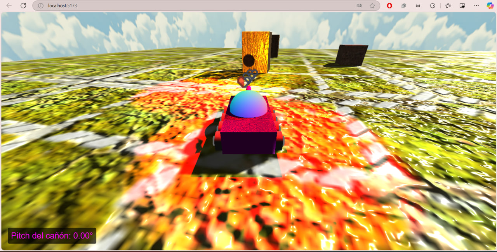
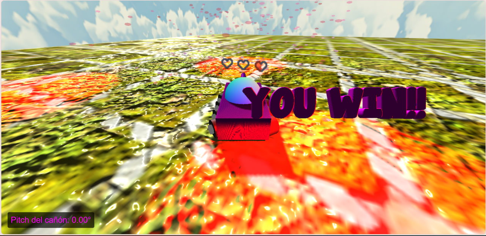
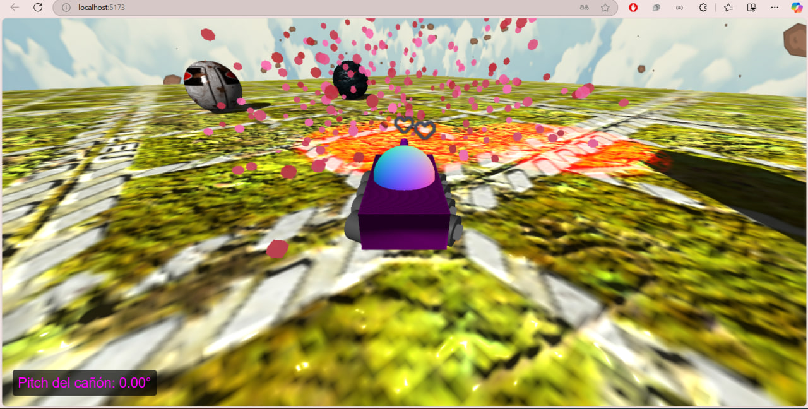
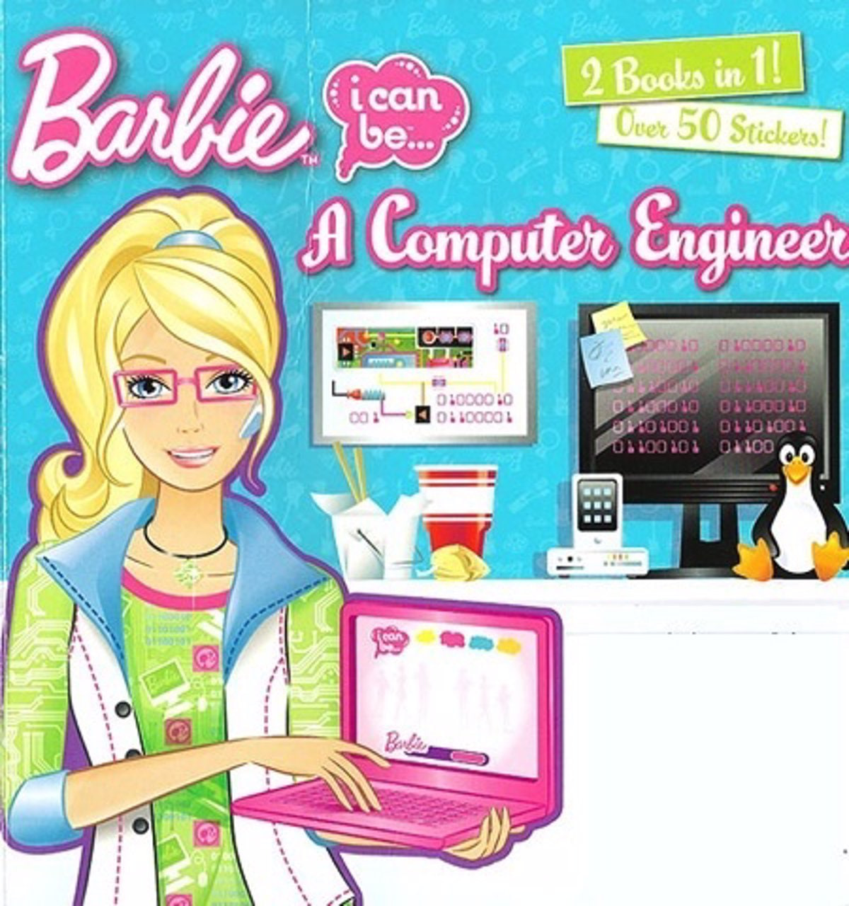

# Proyecto 03 CI4321 
# Tanky Sparkle Wars

## Descripción
Este proyecto, desarrollado con Three.js, simula un entorno 3D interactivo donde el usuario controla un vehículo mediante el teclado. El objetivo principal es destruir obstáculos en el entorno a través de proyectiles que siguen trayectorias rectilíneas y parabólicas.

## Integrantes
- **Jennifer Gámez** - Carnet: 16-10396
- **Amaranta Villegas** - Carnet: 16-11247

## Sistema Operativo de Desarrollo
- **Sistema Operativo:** Windows 10/11

## Dependencias
- `Three.js`: Librería para renderizado y creación de gráficos 3D.
- `npm`: Utilizado para instalar y gestionar dependencias.

## Instrucciones para ejecutar el proyecto

### Requerimientos
- **Node.js** y **npm** instalados en el sistema.
  
### Pasos para ejecutar el proyecto
1. **Clonar el repositorio**:
   ```bash
   git clone https://github.com/amarantaVC/proyecto_03_ci4321
   cd proyecto_03_ci4321
   ```
2. **Instalar dependencias**:
   ```npm install```

3. **Ejecutar el proyecto**:
   ```npm run dev ```

4. **Abrir el navegador**: 

   Una vez iniciado el servidor, abre el navegador y ve a la dirección que se indica en la consola (usualmente http://localhost:5173).

### Controles del Vehículo
El vehículo puede moverse y disparar proyectiles a través de las siguientes teclas:

- Movimiento del vehículo:
  - ↑ (Flecha arriba)    : Mover el vehículo hacia adelante.
  - ↓ (Flecha abajo)     : Mover el vehículo hacia atrás.
  - ← (Flecha izquierda) : Girar el vehículo a la izquierda.
  - → (Flecha derecha)   : Girar el vehículo a la derecha.

- Cambio de vista:
  - 1 : Vista en tercera persona.
  - 2 : Vista aérea.
  - 3 : Vista lateral.

- Control de la torreta:
  - A : Rotar la torreta hacia la izquierda.
  - D : Rotar la torreta hacia la derecha.

- Control del cañón:
  - W : Elevar el cañón.
  - S : Bajar el cañón.

- Disparo de proyectil:
  - Espacio : Disparar un proyectil.

Con estos controles, podrás manejar el vehículo y apuntar la torreta para destruir los obstáculos en la escena.

### Enlaces Importantes
- [Repositorio GitHub](https://github.com/JenniferGamez/proyecto_01_ci4321) 
- [Enlace al video](https://drive.google.com/file/d/19y1mQybNZohxazAm7CqQl11z2FFgvWWJ/view?usp=sharing)

## Capturas de Pantalla








## Barbie luego de la entrega final




